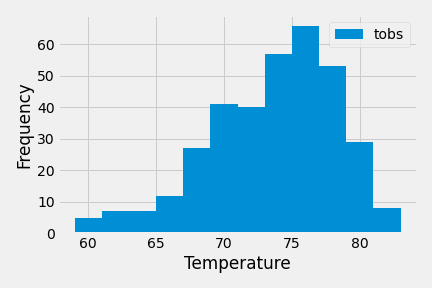

# SQLAlchemy Challenge - Analyzing weather in Hawaii

This repo contains jupyter notebooks and a Flask app that query for weather data in [hawaii.sqlite](Resources/hawaii.sqlite). 

## Precipitation Analysis 

## Station Analysis

## Flask API

### Routes

* `/`
    * Returns a list of all routes that are available.

* `/api/v1.0/precipitation`
    * Returns a dictionary of all measurements using `date` as the key and `prcp` as the value.

* `/api/v1.0/stations`
 * Return a list of stations all stations.

* `/api/v1.0/tobs`
    * Returns dictionary of measurements for the last year of data on the most active station.

* `/api/v1.0/<start>` and `/api/v1.0/<start>/<end>`
    * Returns a list of the minimum temperature, the average temperature and the max temperature for after a given start or start-end range.

- - -

## Bonus: Other Recommended Analyses

* The following are optional challenge queries. These are highly recommended to attempt, but not required for the homework.

### Temperature Analysis I

* Hawaii is reputed to enjoy mild weather all year. Is there a meaningful difference between the temperature in, for example, June and December?

* You may either use SQLAlchemy or pandas's `read_csv()` to perform this portion.

* Identify the average temperature in June at all stations across all available years in the dataset. Do the same for December temperature.

* Use the t-test to determine whether the difference in the means, if any, is statistically significant. Will you use a paired t-test, or an unpaired t-test? Why?

### Temperature Analysis II

* The starter notebook contains a function called `calc_temps` that will accept a start date and end date in the format `%Y-%m-%d`. The function will return the minimum, average, and maximum temperatures for that range of dates.

* Use the `calc_temps` function to calculate the min, avg, and max temperatures for your trip using the matching dates from the previous year (i.e., use "2017-01-01" if your trip start date was "2018-01-01").

* Plot the min, avg, and max temperature from your previous query as a bar chart.

  * Use the average temperature as the bar height.

  * Use the peak-to-peak (TMAX-TMIN) value as the y error bar (YERR).

    

### Daily Rainfall Average

* Calculate the rainfall per weather station using the previous year's matching dates.

* Calculate the daily normals. Normals are the averages for the min, avg, and max temperatures.

* You are provided with a function called `daily_normals` that will calculate the daily normals for a specific date. This date string will be in the format `%m-%d`. Be sure to use all historic TOBS that match that date string.

* Create a list of dates for your trip in the format `%m-%d`. Use the `daily_normals` function to calculate the normals for each date string and append the results to a list.

* Load the list of daily normals into a Pandas DataFrame and set the index equal to the date.

* Use Pandas to plot an area plot (`stacked=False`) for the daily normals.

  

### Copyright

Trilogy Education Services © 2020. All Rights Reserved.
