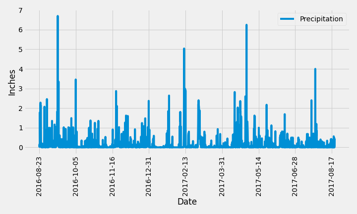
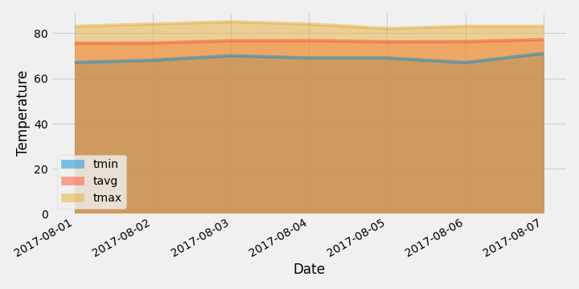

# SQLAlchemy Challenge - Analyzing weather in Hawaii

This repo contains jupyter notebooks and a Flask app that query for weather data in [hawaii.sqlite](Resources/hawaii.sqlite). 

## Precipitation Analysis 

## Station Analysis

## Flask API

### Routes

* `/`
    * Returns a list of all available routes.

* `/api/v1.0/precipitation`
    * Returns a dictionary of all measurements using `date` as the key and `prcp` as the value.

* `/api/v1.0/stations`
    * Returns a list of all stations.

* `/api/v1.0/tobs`
    * Returns a dictionary of measurements for the last year of data on the most active station.

* `/api/v1.0/<start>` and `/api/v1.0/<start>/<end>`
    * Returns a list of the minimum temperature, the average temperature and the max temperature for after a given start date or start-end range.

- - -

### Bonus Analysis I

* Average temp for a year of data displayed as a bar plot with the ends of the error bar representing the peak-to-peak temperature difference from max to min.

### Bonus Analysis II

* Daily temp normals for a week of data displayed as an area plot.

